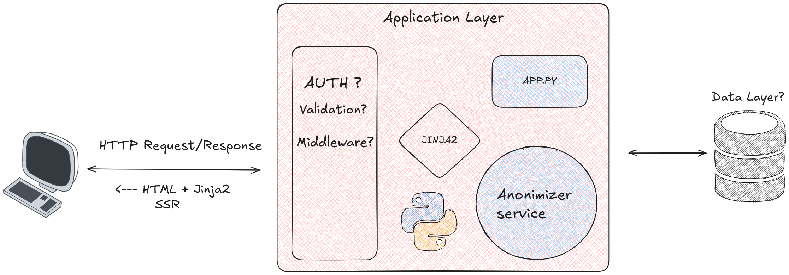

# PromptShield

Anonymize sensitive information in text prompts and documents using multiple interfaces: CLI, Web App, or Browser Extension.




## Features

- **NLP-based anonymization** using spaCy for accurate name detection
- **Regex-based detection** for emails, phone numbers, and monetary amounts
- **Persistent mappings** to maintain consistency across documents
- **Multiple interfaces**: CLI, Web App, Browser Extension
- **Centralized logic** in pip package for easy reuse

## Project Structure

```
PromptShield/
├── packages/pip-package/    # Core anonymization package
│   └── src/pshield/
│       └── pshield.py       # PromptShield class (all functionality)
├── cli/                     # CLI application
│   ├── cli.py
│   └── requirements.txt
├── app.py                   # Web application
├── extension_server.py      # Browser extension API
└── extension/               # Browser extension
```

## Setup

### 1. Install the pshield package

```bash
# Install in editable mode from root
pip install -e packages/pip-package

# Download spaCy language model
python3 -m spacy download en_core_web_sm
```

### 2. Install interface-specific dependencies

**For Web App:**
```bash
pip install -r requirements.txt
```

**For CLI:**
```bash
cd cli
pip install -r requirements.txt
```

## Usage

### CLI Tool

```bash
cd cli

# Anonymize text directly
python3 cli.py -t "John Smith sent $50 to jane@example.com"

# Anonymize from file
python3 cli.py -f example.txt

# Save output to file
python3 cli.py -f document.txt -o anonymized.txt

# Use custom mapping file
python3 cli.py -t "Test data" --mapping-file custom_mappings.json
```

### Web Application

```bash
# From root directory
python3 -m spacy download en_core_web_sm
# and then
flask --app app run
```

Then navigate to `http://localhost:5000`

### Browser Extension Server

```bash
# From root directory
python3 extension_server.py
```

The extension will connect to `http://localhost:5000/anonymize`

### Using as a Python Package

```python
from pshield import PromptShield

shield = PromptShield()
result = shield.anonymize("John Smith sent $50 to jane@example.com")
print(result)  # "name1 sent amt to email1"
```

## Demo

https://promptshield-wq0g.onrender.com/
